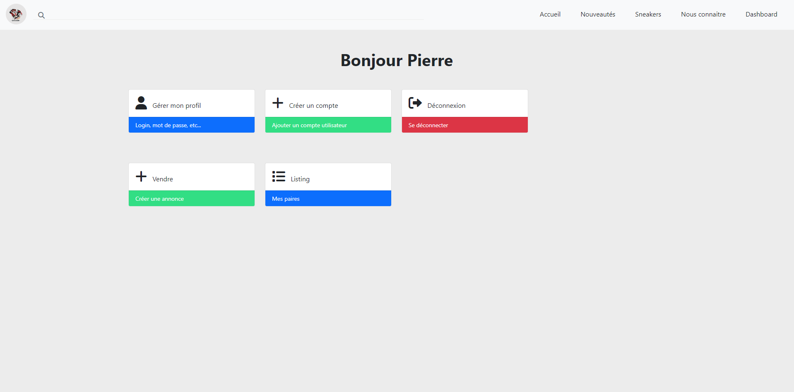

# Documentation Utilisateur

## 1) Accueil 

<i>Page d'accueil du site</i>

Sur cette page on rentrouve les dernières paires qui ont été rentrées par les utilisateurs avec le prix de vente souhaité.

## 2) Se connecter

<i>Page de connexion</i>

Cette page permet de se connecter à son compte. Par défaut un compte est créé avec les droits <strong>*administrateur*</strong>. (utilité renseigné plus tard).

## 3) Dashboard utilisateur

<i>Page de Dashboard utilisateur</i>

Cette page permet de gérer tous les aspects de son compte. A noter que l'option <strong>*créer un compte*</strong> n'est disponnible que pour les profils ayant le droit <strong>*administrateur*</strong>. 

Attention ! : Le bloc <strong>*gérer mon profil*</strong> n'est pas implémenté.

## 4) Créer un compte

<i>Page de Création d'un compte utilisateur</i>

Cette page n'est disponnible que pour les utilisateur possédant le droit <strong>*administrateur*</strong>. C'est à partir de cette page que l'on peut créer un compte.

On définit sont nom d'utilisateur sont mot de passe et si l'on souhaite lui rajouter le droit <strong>*administrateur*</strong>.

## 5) Vendre

<i>Pop up de vente d'une paire</i>

Deux choix possible :
- renseigner un code SKU (code unique pour chaque paire de chaussure fournis par le fabriquant). Cela permet de récupérer automatiquement toutes les données de la paire pour moins de saisies.
- renseigner les informations à la main

### a) Code SKU

<i>Pop up de vente d'une paire avec le code SKU</i>

Ici on a récupérer le code SKU d'une paire sur le site StockX pour l'exemple.

<i>Page de vente</i>

Grâce à ce code nous avons pu récuperer les informations de la paire, à noter que l'image representatif de cette paire à également était récupérer. Il ne nous reste plus qu'a rajouter le prix de vente souhaitai et à valider pour l'enregistrer dans notre listing.

### b) Manuellement

<i>Page de vente</i>

Contrairement à la méthode avec SKU, lorsque l'on choisi de renseigner les informations manuellement nous devons renseigner tous les champs pour valider la publication. A noter qu'il n'y a pas de foncionnalité pour importer une image. Une image par défaut est donc choisi qui ne représente pas forcément la paire réelle.

## 6) Listing

<i>Page de listing</i>

Sur cette page on retrouve toutes les paires enregistrées par l'utilisateur. Il y a également la possiblité de déclarer la paire comme étant vendu en cliquant sur le bouton rouge en bas à droite de chaque vignette. Cette action de vente n'a actuellement aucun effet visuel.

<i>Pop up de vente</i>

